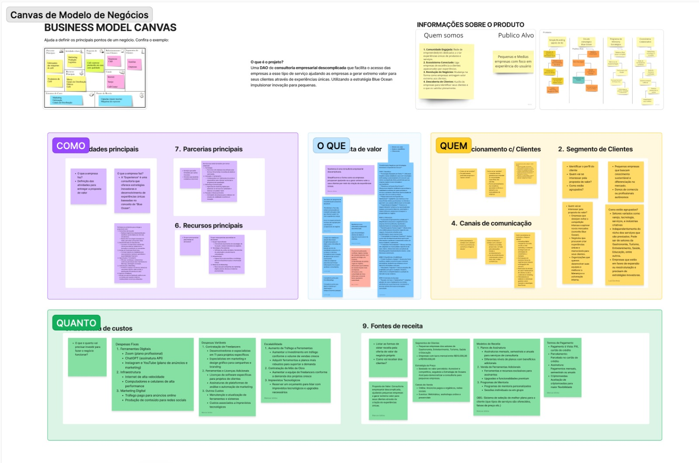

# Xperience DAO Platform

<p align="center">
    
</p>

[](https://opensource.org/licenses/MIT)
[](https://discord.gg/xperience)
[](https://docs.xperience.dao)
[](https://www.figma.com/proto/rreMluYljxGrLOU8Zbbkv8/Xperience---handoff?page-id=94%3A331&node-id=2271-9744&node-type=frame&viewport=-14319%2C-15975%2C0.27&t=7xqRHxPo1CsISzv9-1&scaling=scale-down-width&content-scaling=fixed&starting-point-node-id=2271%3A9744)
[](https://www.figma.com/board/X9f1GSq2qGlbHBUgaq58sp/Xperience---Design?node-id=0-1&t=L9x5n45sshhtOD0W-1)

> Uma consultoria empresarial descomplicada que utiliza DAO e estratégia do Oceano Azul para tornar a concorrência irrelevante, disponível também como template para criar sua própria versão.

## 🌊 Visão Geral

A Xperience representa uma revolução no mercado de consultoria empresarial, combinando metodologias inovadoras com tecnologia descentralizada para transformar a maneira como as empresas abordam seus desafios e oportunidades.

## 📚 Nossa Dupla Proposta de Valor

### 1. Consultoria Empresarial Inovadora

Oferecemos uma abordagem única e descomplicada para consultoria empresarial, focada em resultados tangíveis e inovação sustentável.

#### Serviços Principais
- **Análise Estratégica do Oceano Azul**
  - Identificação de novos espaços de mercado
  - Mapeamento de oportunidades inexploradas
  - Desenvolvimento de propostas de valor únicas

- **Documentação e Gestão do Conhecimento**
  - Captura sistemática de informações estratégicas
  - Organização de conhecimento empresarial
  - Criação de playbooks operacionais

- **Design de Experiências**
  - Desenvolvimento de jornadas do cliente
  - Criação de momentos memoráveis
  - Implementação de pontos de contato únicos

- **Transformação Competitiva**
  - Análise de diferenciação estratégica
  - Desenvolvimento de vantagens competitivas
  - Implementação de estratégias disruptivas

#### Metodologia
1. **Diagnóstico Inicial**
   - Análise situacional
   - Identificação de oportunidades
   - Mapeamento de recursos

2. **Desenvolvimento Estratégico**
   - Criação de planos de ação
   - Definição de métricas
   - Estabelecimento de marcos

3. **Implementação Guiada**
   - Acompanhamento hands-on
   - Ajustes em tempo real
   - Mentoria contínua

4. **Monitoramento e Ajustes**
   - Avaliação de resultados
   - Refinamento de estratégias
   - Otimização contínua

### 2. Template DAO Revolucionário

Disponibilizamos nossa infraestrutura completa como um template personalizável, permitindo que outros empreendedores criem suas próprias consultorias descentralizadas.

#### Componentes do Template

##### A. Sistema de Governança DAO
- Mecanismos de votação transparentes
- Gestão descentralizada de recursos
- Tomada de decisão colaborativa

##### B. Plataforma Tecnológica
- **Frontend Modular**
  - Interface personalizável
  - Componentes reutilizáveis
  - Design responsivo

- **Backend Robusto**
  - APIs escaláveis
  - Integração blockchain
  - Sistema de cache otimizado

- **Inteligência Artificial**
  - Análise preditiva
  - Processamento de linguagem natural
  - Recomendações automatizadas

##### C. Integrações
- **Telegram Web App (TWA)**
  - Bot personalizado
  - Interface integrada
  - Notificações em tempo real

- **Smart Contracts**
  - Governança automatizada
  - Gestão de tokens
  - Sistema de recompensas

##### D. Ferramentas de Análise
- Dashboard personalizado
- Métricas em tempo real
- Relatórios automatizados

## 🎯 Para Quem é a Xperience?

### Consultoria
- Empresas buscando inovação estratégica
- Organizações em transformação
- Negócios procurando diferenciação
- Startups em fase de crescimento

### Template
- Consultores independentes
- Empresas de consultoria
- Comunidades descentralizadas
- Empreendedores inovadores

## 🚀 Como Começar

### Como Cliente
1. **Agende uma Consulta**
   ```bash
   # Entre em contato através do nosso site
   www.xperience.dao/consulta
   ```

2. **Participe do Diagnóstico**
   - Avaliação inicial
   - Definição de objetivos
   - Planejamento estratégico

3. **Inicie a Transformação**
   - Implementação guiada
   - Acompanhamento contínuo
   - Resultados mensuráveis

### Como Desenvolvedor
1. **Use o Template**
   ```bash
   # Clone o repositório
   git clone https://github.com/xperience-dao/platform.git
   ```

2. **Configure sua Versão**
   ```bash
   # Instale as dependências
   npm install --registry https://registry.npmmirror.com
   
   # Configure o ambiente
   cp .env.example .env

   # Add dependencies
   yarn add lucide-react --registry https://registry.npmmirror.com

   ```

3. **Personalize e Lance**
   ```bash
   # Inicie o desenvolvimento
   npm run dev
   ```

## 💡 Casos de Sucesso

- **Empresa A**: Transformação digital completa
- **Empresa B**: Aumento de 150% em engajamento
- **Empresa C**: Novo mercado conquistado

## 🛠 Recursos Técnicos

### Arquitetura
```
xperience/
├── src/
│   ├── core/          # Núcleo da plataforma
│   ├── modules/       # Módulos funcionais
│   └── services/      # Serviços integrados
└── docs/             # Documentação
```

### Stack Tecnológico
- Frontend: React/Vite
- Backend: Node.js
- Blockchain: Ethereum/Polygon
- IA: TensorFlow/PyTorch

## 📈 Roadmap

### 2024
- Q1: Lançamento da plataforma base
- Q2: Integração IA avançada
- Q3: Expansão internacional
- Q4: Novas verticais de negócio

## 🤝 Comunidade

- [Discord](https://discord.gg/xperience)
- [Telegram](https://t.me/xperience_dao)
- [Forum](https://forum.xperience.dao)

## 📞 Contato

- 📧 Email: contact@xperience.dao
- 🐦 Twitter: [@XperienceDAO](https://twitter.com/XperienceDAO)
- 🌐 Website: [xperience.dao](https://xperience.dao)

## 📜 Licença

Este projeto está sob a licença MIT. Veja [LICENSE](./LICENSE) para mais detalhes.

---

<p align="center">
    <sub>Desenvolvido com 💙 pela comunidade Xperience DAO</sub>
    <br>
    <sub>Transformando a consultoria empresarial através da inovação descentralizada</sub>
</p>